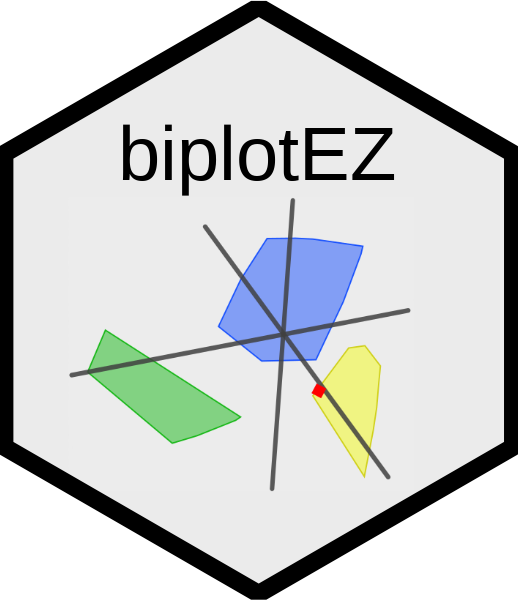

# Multivariate Data Analysis Group (MDAG) workshop



Website: []()

Biplots are valuable visualisation tools in exploratory data analysis. In its simplest form, biplots are regarded as generalised scatterplots for more than two variables. The rows of a data matrix are represented as sample points while the columns are represented as variable axes. Although the interpretation in terms of samples and variable axes dates from the work of Gower in the 1990’s, the application has been limited by the availability of EZ-to-use software. In this presentation we will look at the basic linear algebra behind popular forms of biplots: Principal Component Analysis (PCA), Canonical Variate Analysis (CVA) and biplots of Correspondence Analysis (CA) amongst others. The availability of software limits biplot application to expert users. Providing an EZier to use package for practitioners wanting to visualise their data, encouraged the development of a user-friendly R package. In this workshop you will be introduced to the main aspects of biplot methodology and receive access to the newly developed functions of the biplotEZ R package with applications on real data in various contexts.

Background: Participants should have a good working knowledge of R, and some background in multivariate statistical methods and/or data mining techniques.

**Presenters**: 

Sugnet Lubbe, Niël J le Roux, Johané Nienkemper-Swanepoel, Raeesa Ganey, Ruan Buys, Zoë-Mae Adams and Peter Manefeldt

## Structure of tutorial

Background: Participants should have a good working knowledge of R, and some background in multivariate statistical methods and/or data mining techniques.

| time | topic | speaker |
|------|-------|-------|
|14:00-14:05|	Introduction| Sugnet Lubbe |
|14:05-15:05|	Principal component analysis biplots| Raeesa Ganey and Ruan Buys|
|15:05-15:30|	Correspondence Analysis biplots| Johané Nienkemper-Swanepoel |
|15:30-16:00|	BREAK|
|16:00-16:30|	Canonical correspondence analysis biplots| Zoë-Mae Adams and Peter Manefeldt |
|16:30-16:40|	1D biplots| Peter Manefeldt |
|16:40-16:50|	3D biplots| Zoë-Mae Adams |
|16:50-17:00|	Other biplots and conclusion| Sugnet Lubbe |

[MDAG workshop slides](https://github.com/MuViSU/SASA2024_MDAG/blob/main/MDAG2024_biplotEZ.html)

## Getting started

1. Ensure that you have a recently updated version of R Studio.

```
install.packages("biplotEZ")
```

Ideally, you install this package from GitHub:

```
remotes::install_github("MuViSU/biplotEZ")
```


## Reporting

If you have a suggestion or a bug report please post this as an [issue](https://github.com/MuViSU/SASA2024_MDAG/issues) on GitHub.
